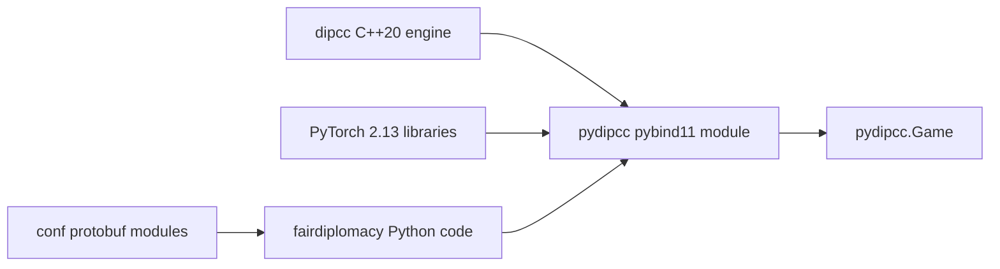

# `dipcc` Integration

`dipcc` provides the Diplomacy rules engine. CMake compiles its pybind11 module
as an ABI-tagged `pydipcc` shared library in `fairdiplomacy/`, where normal
package import exposes it as:

```python
from fairdiplomacy import pydipcc
```

## Boundary



The native extension owns game state, adjudication, legal-order generation,
encoding, scoring, and serialization. Python agents query and mutate games
through the bound classes.

## Build contract

The supported extension is compiled with:

- Ubuntu 24.04;
- Python 3.12;
- the final PyTorch 2.13 CPU or cu130 wheel;
- C++20 and GCC 13;
- CMake 3.28+ and Ninja;
- pybind11 3.0.4; and
- glog/gflags config packages.

The filename is platform- and interpreter-specific, for example:

```text
pydipcc.cpython-312-x86_64-linux-gnu.so
```

Never copy a `pydipcc` binary between Python versions, architectures, or
PyTorch variants.

## Build flow

```bash
make protos
PYDIPCC_OUT_DIR="$PWD/fairdiplomacy" \
N_DIPCC_JOBS=4 \
./dipcc/compile.sh
```

`dipcc/compile.sh` passes the active interpreter to CMake, discovers
pybind11's config directory from that interpreter, finds PyTorch's CMake
package, and builds the `pydipcc` target.

## Import flow

`fairdiplomacy/__init__.py` imports the package-relative extension directly.
The build must therefore place the artifact in `fairdiplomacy/`, as the
canonical `PYDIPCC_OUT_DIR` commands and runtime images do.

Verify the resolved artifact:

```bash
python -c \
  "from fairdiplomacy import pydipcc; print(pydipcc.__file__)"
```

## Main API

- `pydipcc.Game` — game state, orders, adjudication, scores, and JSON
- `pydipcc.ThreadPool` — batched game processing/encoding
- `pydipcc.PhaseData` — phase snapshots
- CFR statistic bindings used by search agents

Minimal smoke:

```python
from fairdiplomacy import pydipcc

game = pydipcc.Game()
assert game.current_short_phase == "S1901M"
game.process()
```

## Validation

```bash
python test_pydipcc.py
python -m unittest unit_tests.test_full_integration
python -m pytest dipcc/python/test_thread_pool.py -q
```

Docker and Modal also run multi-turn adjudication checks, not only imports.

## Failure modes

- **`ModuleNotFoundError`** — build did not write the extension into
  `fairdiplomacy/`, or `PYTHONPATH` does not include the repository.
- **undefined Python symbols** — extension was built for another interpreter
  or without Python's development module.
- **missing Torch libraries** — PyTorch was replaced after the native build.
- **wrong architecture** — a shared object was copied from another host/image.
- **glog/gflags CMake errors** — Ubuntu development packages are absent or an
  unrelated environment shadows their config files.

See [`DIPCC_BUILD_NOTES.md`](../DIPCC_BUILD_NOTES.md) for build commands.
