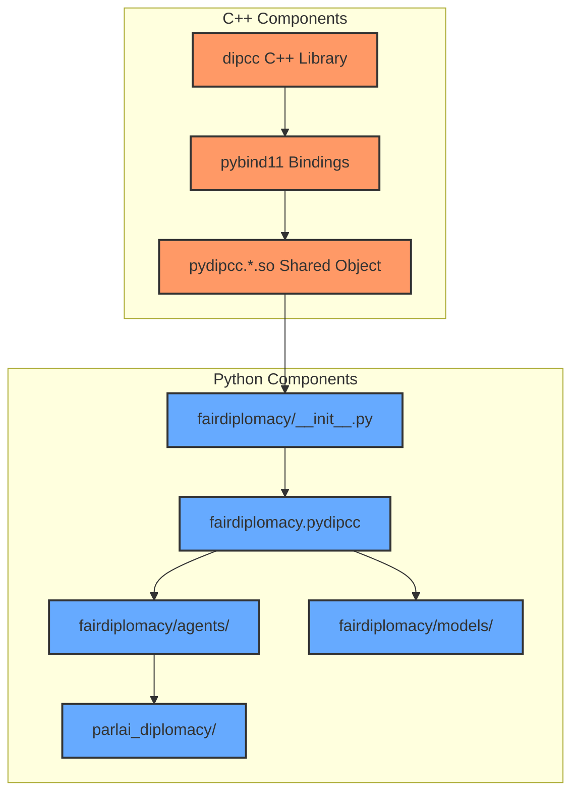
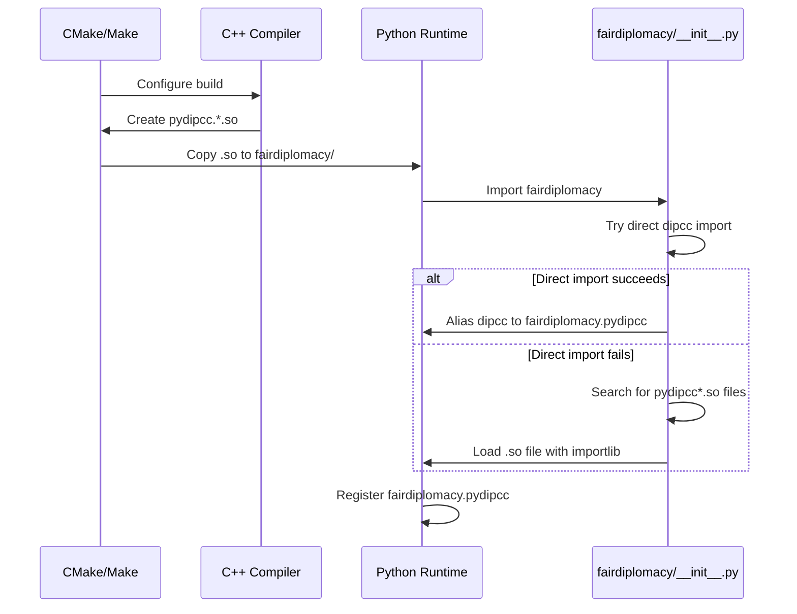
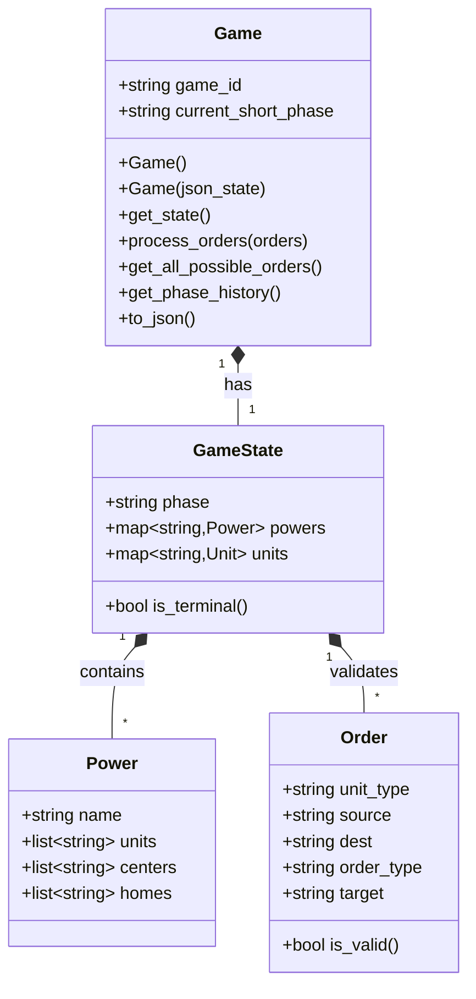
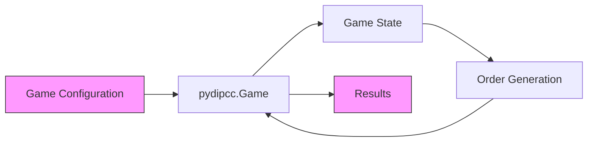
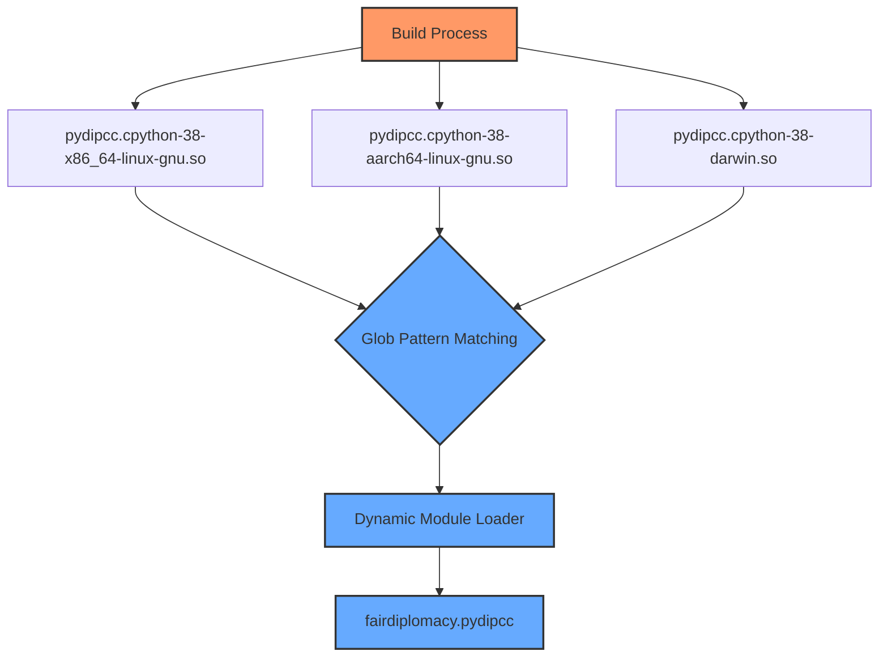

# Module Dependencies Diagram

This document provides a visual representation of the module dependencies in the Diplomacy Cicero project, with a focus on the relationship between dipcc and fairdiplomacy.pydipcc.

## Component Architecture

The diagram below shows the main components and their relationships:

## Build and Import Flow

This diagram shows the build and import process:

## Module Structure

This diagram shows the internal structure of the dipcc C++ library:

## Data Flow

This diagram shows the data flow during a typical game simulation:

## Cross-Platform Compatibility

This diagram illustrates the platform-specific module loading process:

These diagrams provide a visual representation of the module dependencies and interactions in the Diplomacy Cicero project. They can be rendered using tools that support the Mermaid diagram syntax.